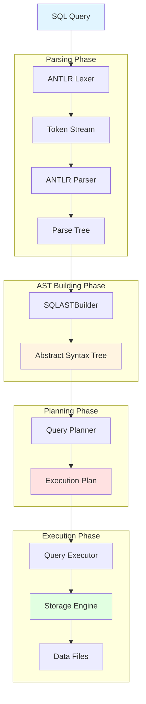
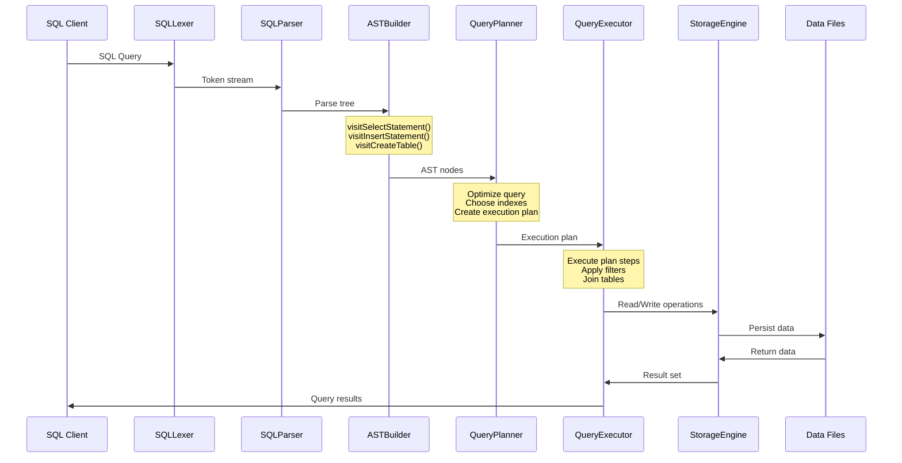

# TheDB Server

TheDB is a MySQL-like relational database management system written purely in Java using ANTLR for SQL parsing.

## Author

Peter \<peter@hkprog.org>, Chairman of Hong Kong Programming Society

## Build

```bash
mvn clean package
```

## Run Server

```bash
java -jar target/thedb-server-0.0.1-shaded.jar server
```

## Run SQL Script

```bash
java -jar target/thedb-server-0.0.1-shaded.jar execute <file.sql>
```

## Interactive Console

```bash
java -jar target/thedb-server-0.0.1-shaded.jar console
```

## Example

```bash
java -jar target/thedb-server-0.0.1-shaded.jar execute example/create_tables.sql
```

## Architecture



### Query Processing Pipeline



### Key Components

1. **Grammar Files** (`SQLLexer.g4`, `SQLParser.g4`)
   - Define SQL syntax and tokens
   - ANTLR generates lexer and parser classes
   - Support for: SELECT, INSERT, UPDATE, DELETE, CREATE, DROP, ALTER

2. **AST Nodes** (`org.hkprog.thedb.ast.*`)
   - Type-safe representation of SQL statements
   - Visitor pattern for traversal
   - DDL, DML, and DQL nodes

3. **Query Planner** (`QueryPlanner.java`)
   - Analyzes AST to create optimal execution plan
   - Index selection and optimization
   - Cost-based optimization

4. **Storage Engine** (`org.hkprog.thedb.storage.*`)
   - B+ Tree indexes
   - Page-based storage management
   - Transaction support with ACID properties
   - Write-ahead logging (WAL)

5. **Query Executor** (`QueryExecutor.java`)
   - Executes query plans
   - Implements joins, aggregations, sorting
   - Result set management

6. **Server** (`TheDBServer.java`)
   - TCP/IP server for client connections
   - Protocol compatible with MySQL wire protocol
   - Multi-threaded request handling

## Features

- **SQL Support**: SELECT, INSERT, UPDATE, DELETE, CREATE TABLE, DROP TABLE, ALTER TABLE
- **Data Types**: INT, VARCHAR, TEXT, DATE, DATETIME, DECIMAL, BOOLEAN
- **Indexes**: Primary keys, secondary indexes, unique constraints
- **Joins**: INNER JOIN, LEFT JOIN, RIGHT JOIN, FULL OUTER JOIN
- **Aggregations**: COUNT, SUM, AVG, MIN, MAX, GROUP BY, HAVING
- **Transactions**: BEGIN, COMMIT, ROLLBACK
- **Isolation Levels**: READ COMMITTED, REPEATABLE READ, SERIALIZABLE
- **Storage**: Persistent B+ Tree-based storage
- **Logging**: Write-ahead log for crash recovery

## Limitations

This is an educational database system. Not recommended for production use.

## License

Apache License
